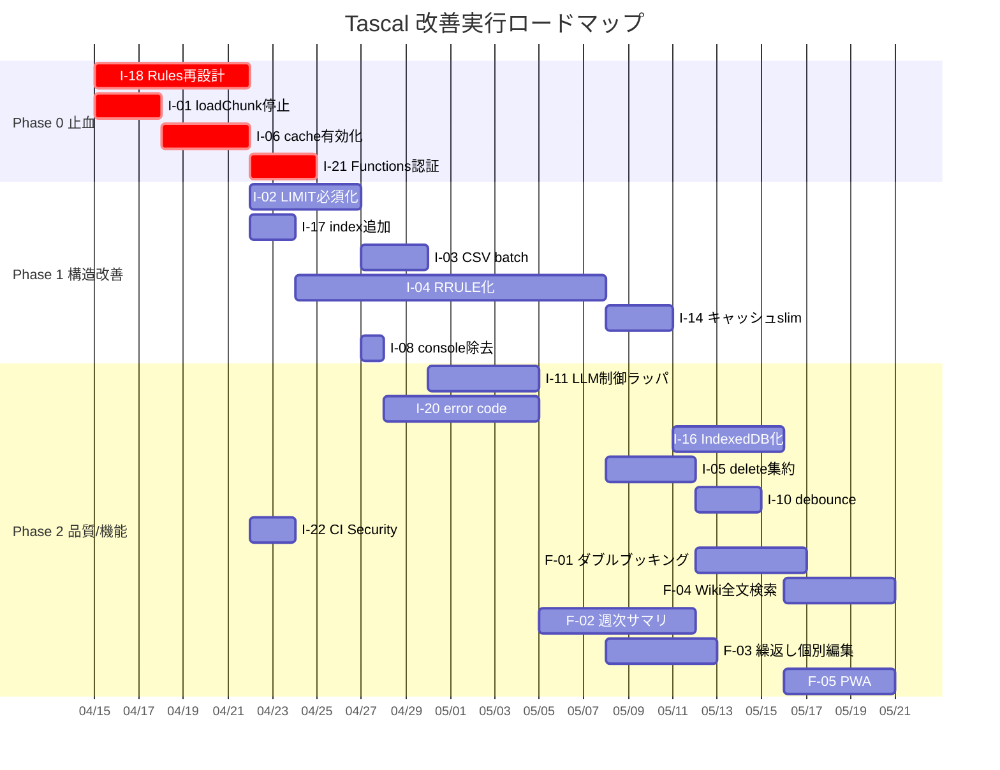

# Tascal 改善提案 & 機能追加提案

> 本ドキュメントは `review-results.md` の指摘事項 C-01〜C-22 に 1:1 対応する改善提案 (I-XX) と、独立した機能追加提案 (F-XX) を記載する。
> 各提案は `core-principles.md` の最上位原則「ユーザーの意図を完遂させる」と、開発原則 1〜9 への適合を前提とする。

---

## 1. 優先度マトリクス (Impact × Effort)

```mermaid
quadrantChart
    title 改善提案 優先度マトリクス
    x-axis Low Effort --> High Effort
    y-axis Low Impact --> High Impact
    quadrant-1 Quick Wins (即実施)
    quadrant-2 Strategic (計画実施)
    quadrant-3 Low Priority
    quadrant-4 Fill-in
    "I-18 Rules再設計": [0.35, 0.99]
    "I-01 loadChunk停止": [0.15, 0.95]
    "I-06 cache有効化": [0.20, 0.95]
    "I-21 Func認証": [0.25, 0.85]
    "I-04 RRULE化": [0.80, 0.80]
    "I-11 LLM制御": [0.45, 0.70]
    "I-03 CSV batch": [0.30, 0.65]
    "I-17 index追加": [0.15, 0.60]
    "I-20 error code": [0.60, 0.55]
    "I-12 console drop": [0.10, 0.35]
    "I-22 Dependabot": [0.10, 0.40]
```

### フェーズ分割

| フェーズ | 狙い | 含まれる提案 |
|---------|------|------------|
| **Phase 0 (止血)** | 現在 CRITICAL / 高リスクの事故を停止 | **I-18, I-01, I-06, I-21** |
| **Phase 1 (構造改善)** | 根本原因に対処しコスト・設計負債を削減 | I-02, I-03, I-04, I-08, I-14, I-17 |
| **Phase 2 (品質と機能追加)** | 運用可観測性 / 可読性 / 新機能 | I-05, I-07, I-10, I-11, I-12, I-13, I-15, I-16, I-20, I-22, F-01〜F-05 |

---

## 2. Phase 0 (止血) — 最優先改善

### I-18: Firestore Security Rules の最小権限再設計 (対応: C-18)

**現状:** `firestore.rules:1-9` が `allow read, write: if request.auth != null;` のみで、認証ユーザーなら全コレクション全件 read/write 可能。

**提案:**
1. 全コレクションに対してコレクション固有のルールを定義する (catch-all `{document=**}` は廃止)。
2. 代表的な設計パターン:
   - `users/{uid}`: 本人のみ read/write、管理者 (`request.auth.token.admin == true`) は read
   - `events/{id}`: `resource.data.participantIds` に自分の uid が含まれる場合のみ read、`createdBy == request.auth.uid` のみ update/delete
   - マスタ系 (`team`, `section`, `facility`, `equipment`): 全員 read、管理者のみ write
   - `wikiArticles/{id}`: 全員 read、`createdBy == request.auth.uid` のみ write
   - `expense`, `attendance`: 本人 + 承認者のみ read、本人のみ write
3. `list` と `get` のルール差を意識。`list` では `exists()`/`get()` がクエリ制約から検証不可 (CLAUDE.md Firestore 確認ポイント参照)。クエリ側も合わせて `where('participantIds', 'array-contains', request.auth.uid)` 等で絞る必要がある。
4. `firestore rules test` で単体テストを追加 (`@firebase/rules-unit-testing`)。
5. **段階リリース:** 新ルールは staging プロジェクトで動作確認後、本番反映。既存クライアントが `permission-denied` を起こさないようクエリ側の先行修正が必須 (下位互換性の原則 7)。

**リスク:** クエリ側の修正が間に合わないと本番で機能停止する。**クライアントクエリの修正 → ルール更新** の順で進める。

**検証:** `firebase emulators:start --only firestore` + ルールテスト + 本番前に 24h staging 稼働。

---

### I-01: loadChunkAsync の無制限全件読み込みを停止 (対応: C-01)

**現状:** `composables/firestoreGeneral/useFirestoreGeneral.ts:133-170` は事実上「1 コールでコレクション全件読込」を行い、行 165-169 のデッドコード (`lastVisible.value = null` を両分岐で実行) によってページング状態が毎回破棄される。

**提案:**
1. **即時対応:** 呼び出し元を全 Grep し、`loadChunkAsync` を使っている箇所を特定。必要な箇所は `loadAsync(20)` の繰り返し呼び出し (UI イベント駆動) に置換。
2. `loadChunkAsync` 自体に `maxPages: number` 引数を追加し、デフォルト 5 (= 100 件) でハードリミットを課す。`maxPages` 到達時は返り値に `{ hasMore: true, nextCursor }` を含め、呼び出し元が明示的に続行を要求できるようにする。
3. 行 165-169 の `lastVisible.value = null` 両分岐を削除し、ページング状態を維持。
4. TypeScript の型を `any[]` から `T[]` に絞り込む (既存ジェネリック化を検討)。

**リスク (下位互換):** `loadChunkAsync` が 100 件で打ち切られることで、全件前提のロジックが欠落を起こす可能性。呼び出し元の洗い出しが必須。

**検証:** 修正後、Firestore Emulator で 1,000 件のデータを流し、`loadChunkAsync()` が 100 件で止まり `hasMore: true` を返すことを確認。

---

### I-06: HTTP キャッシュ無効化の廃止 (対応: C-06)

**現状:** `services/eventService.ts:129` `forceNoCache = true` がデフォルト。行 135 で `?v=${Date.now()}` 付与、行 140 で `cache: 'no-store'`。Cloud Functions 側の `cacheControl: public, max-age=3600` (`functions/src/index.ts:166`) が完全に死んでいる。

**提案:**
1. `forceNoCache` デフォルトを `false` に変更。`?v=` は削除、`cache:` 指定も外してブラウザ/CDN デフォルトに任せる。
2. **キャッシュ無効化戦略:** 更新時はキャッシュキー (週キー) に `version` フィールドを持たせ、Firestore の `cache_version/{weekKey}` に世代番号を置く。クライアントは初回取得時に世代番号を読み、HTTP fetch URL に `?v=${version}` を付与する。世代が変わらない限り HTTP キャッシュ (max-age=3600) がそのまま効く。
3. Cloud Functions 側のトリガー (`functions/src/index.ts:254-258`) でキャッシュ再生成時に `cache_version/{weekKey}.version` をインクリメント。
4. 観測: クライアントは取得時に `response.headers.get('x-cache')` 等を `functions.logger` 相当のログに残し、実際にキャッシュヒット率が上がっているか計測。

**効果 (推定):**
- ユーザー体感劣化の解消: カレンダー開閉時の毎回フェッチ → 初回のみ (体感 200ms 基準達成の可能性が大幅上昇)
- Cloud Storage egress / Functions 起動の削減: 同じ週キーへのアクセスが集中する通常運用では 90%+ のリクエスト削減が期待できる

---

### I-21: initialCacheGeneration に認証を追加 (対応: C-21)

**現状:** `functions/src/index.ts:178-200` は `https.onRequest` で認証未実装。URL が漏れれば誰でも `events` 全走査を起動できる。

**提案:**
1. `https.onCall` に変更し、`context.auth.token.admin == true` チェックを追加。管理者のみ実行可能にする。
2. もしくは HTTP のまま Firebase App Check を有効化し、クライアントからのみ叩けるようにする。加えて header の `Authorization: Bearer <ID token>` を verify。
3. 呼び出し頻度制限: 同一 uid から 1 時間に 1 回まで (`rate_limit` コレクションで管理)。

**検証:** staging で管理者権限なしユーザーが 403 を受け取ることを確認。

---

## 3. Phase 1 (構造改善) — 中期的なコスト/負債削減

### I-02: 全 getCollection 系 API の LIMIT 必須化 (対応: C-02, C-03)

**提案:**
1. `composables/firestoreGeneral/useFirestoreGeneral.ts:73-89` の `getListAsync` の引数型を `QueryConstraint[]` から `RequiredLimitQueryConstraints` (自作型) に変更し、`limit()` を含まない呼び出しを TypeScript エラーにする。
2. `composables/useCsvFirestore.ts:102-122` の `fetchData()` にプレビュー用デフォルト `limit(100)` を追加。全件が必要なエクスポートは専用 Function (ストリーミング) に分離。
3. 呼び出し元を全 Grep (`getListAsync(`, `getCollectionAsync(`) し、1 箇所ずつ安全な上限を設定。

**効果:** 最悪ケース時の Firestore read 爆発を遮断。コスト上限が予測可能になる。

---

### I-03: CSV インポートのバッチ書込化 (対応: C-09)

**現状:** `composables/useCsvFirestore.ts:196-201` が `addDocAsync` の逐次呼び出し。

**提案:**
1. `firebase/firestore` の `writeBatch` を使用し、500 件/バッチに分割。
2. 進捗 UI (例: `Imported 350/1000...`) を追加。
3. 途中失敗時は「どのバッチまで成功したか」を UI に表示 (原則 4: 非ブロッキングなエラーハンドリング)。
4. 各バッチ完了後、`writeBatch.commit()` の結果を `console.error` ではなく、UI 側のエラー状態 (例: `ref<ImportError[]>`) に反映する。

**効果:** 1000 件インポートが 1000 req → 2 req に圧縮。体感 10-50 倍高速化、Firestore write 課金は 500 件/バッチの割引が効き、クライアント側タイムアウトも減る。

---

### I-04: 繰り返し/範囲イベントの RRULE 化 (対応: C-07, C-08)

**現状:** `services/eventService.ts:41-121` が繰り返しを最大 20 年分の日次展開、222-230 行で範囲イベントを日ごとに個別ドキュメント化。

**提案 (中期):**
1. **データモデル変更:**
   - `events` コレクションに `recurrenceRule: string` (iCalendar RRULE 形式、例: `FREQ=WEEKLY;BYDAY=MO,WE,FR;UNTIL=20270101`) を追加。
   - `startDate`, `endDate` (範囲) は 1 ドキュメントで保持。
2. **表示時展開:** `rrule.js` (軽量ライブラリ) で view 範囲内のインスタンスだけを都度計算。
3. **インスタンス例外:** 特定インスタンスの編集は `event_exceptions/{eventId}/{yyyymmdd}` サブコレクションで overlay 管理。
4. **マイグレーション:** 既存の日次展開データを 1 ドキュメント化する Cloud Function (ワンショット) を用意。原則 7 (下位互換) に従い、段階リリース + ロールバック手順をドキュメント化。

**効果:**
- Firestore ストレージ: 1 年分の週次繰り返し = 52 doc → 1 doc に圧縮
- Firestore read: 表示時の読み込みコストが大幅減
- 編集 UX: 「この週だけ変更」「今後すべて変更」を正しく分離できる (F-03 と連動)

**リスク:** 過去データの移行失敗。staging で全件マイグレーションリハーサル必須。

---

### I-08: 本番ビルドから console を除去 (対応: C-12)

**提案:** `nuxt.config.ts` に:
```ts
vite: {
  esbuild: {
    drop: process.env.NODE_ENV === 'production' ? ['console', 'debugger'] : [],
  },
},
```
または `unplugin-drop-console` を導入。

**注意:** `console.error` は意図的に残すべき箇所 (catch 内の最低限ログ出力、CLAUDE.md エラーハンドリング参照) があるため、`drop` ではなく専用ユーティリティ `logger.error` に置き換える方が安全。I-20 (エラーコード体系) と合わせて実施する。

---

### I-14: キャッシュ JSON のスリム化 (対応: C-14)

**現状:** `services/eventService.ts:156-168` で `EventDisplay` が `participantIds` と並列に `participants` オブジェクトも保持。

**提案:**
1. キャッシュには ID 配列のみ保存。
2. クライアント側でマスタデータ (`users`, `facility`, `equipment`) を `useState` / IndexedDB でキャッシュし、表示時 join。
3. マスタデータは変更頻度が低いため TTL 24h でも問題なし。

**効果:** キャッシュ JSON のサイズが 50-80% 削減され、egress と parse 時間が同比率で減。

---

### I-17: Firestore 複合 index の追加 (対応: C-17)

**提案:** `firestore.indexes.json` に不足している複合インデックスを追加:
```json
{
  "collectionGroup": "events",
  "queryScope": "COLLECTION",
  "fields": [
    { "fieldPath": "date", "order": "ASCENDING" },
    { "fieldPath": "participantIds", "arrayConfig": "CONTAINS" }
  ]
}
```
他、`deleteEvent('after'/'before')` や日付範囲クエリで使っている `where` 組み合わせを全件洗い出し、必要な index を追加。

**検証:** `firebase deploy --only firestore:indexes` + Firestore コンソールでの build 状況確認。

---

## 4. Phase 2 (品質 & 運用強化) — 中長期

### I-05: deleteEvent のサーバー集約 (対応: C-05)

**提案:** `services/eventService.ts:358-388` のクライアント側 `where` + 個別 delete を廃止し、`deleteEventSet` Cloud Function (onCall) を新設。Function 内で `writeBatch` を使い 500 件単位で削除。client には進捗だけ返す。

### I-07: 繰り返しイベントの個別インスタンス編集 UI (対応: I-04 前提)

**注記:** I-04 の RRULE 化を前提とする。UI 上で「この日だけ変更」「今後すべて変更」「すべて変更」の 3 つをラジオで提示。

### I-10: キャッシュ再生成の debounce (対応: C-10)

**提案:** `functions/src/index.ts:254-258` のイベント CUD トリガーで、同一週キーへの再生成要求を Pub/Sub + Cloud Tasks でキューイングし、30 秒以内の連続変更を 1 回の再生成にまとめる。

### I-11: Vertex AI コスト制御ラッパ (対応: C-11)

**提案:**
1. `composables/useLLM.ts` を新設し、Vertex AI への全アクセスをここに集約。
2. 呼び出し前に `llm_usage/{uid}/{YYYYMMDD}` を Firestore で参照し、日次トークン上限 (例: 100k tokens/user) を超えていたら拒否。
3. 呼び出し後、実使用トークンを同ドキュメントに記録 (`FieldValue.increment`)。
4. プロンプトキャッシュ (Gemini の `cachedContent` API) を利用し、システムプロンプトや大きな前提ドキュメントの再送を避ける。
5. 指数バックオフ付きのリトライ (最大 3 回) を実装し、無制限リトライを回避。

**効果:** LLM コストの予測可能化、悪意/誤動作によるコスト爆発を防ぐ。

### I-12: (→ I-08 に統合)

### I-13: 画像最適化と初期表示改善 (対応: C-13)

**提案:** `@nuxt/image` 導入。`<NuxtImg>` で `format="webp,avif"` `loading="lazy"`。加えて Nuxt のルート分割 + dynamic import で初期バンドル削減。`ssr: false` は維持しても初回 JS ダウンロード量は半減可能。

### I-15: WebSocket 再接続の復活 (対応: C-15)

**提案:** `composables/useWebSocket.ts:17-48` の再接続ロジックをコメントアウトから復帰し、指数バックオフ (2s, 4s, 8s, 最大 30s) で実装。あるいは、Firestore `onSnapshot` に移行可能か検討 (運用コストと設計コストのトレードオフ)。

### I-16: クライアントキャッシュの IndexedDB 化 + dedupe (対応: C-16)

**提案:**
1. `idb-keyval` を導入し、`useCalendar` の `masterDataCache` をページリロードまたぎで有効化。
2. 同一キャッシュキーへの並行 fetch は keyed Promise Map で dedupe:
```ts
const inflight = new Map<string, Promise<EventDisplay[]>>()
function getCached(key: string) {
  if (inflight.has(key)) return inflight.get(key)!
  const p = fetchImpl(key).finally(() => inflight.delete(key))
  inflight.set(key, p)
  return p
}
```
3. マジックナンバー TTL (`10h`, `1h`) を定数化 (`constants/cache.ts`)。

### I-20: エラーコード体系の導入 (対応: C-20)

**提案:**
1. `constants/errorCodes.ts` に全エラーコード定義を集約:
```ts
export const ERROR_CODES = {
  EVENT_FETCH_FAILED: 'E_EVT_001',
  EVENT_DELETE_FAILED: 'E_EVT_002',
  CSV_IMPORT_VALIDATION: 'E_CSV_001',
  // ...
} as const
```
2. `logger.error(ERROR_CODES.EVENT_FETCH_FAILED, { context, hint })` 形式のラッパを用意し、必須フィールド (`error_code`, `context`, `repair_hint`) を強制。
3. `.ai-native/methodology/common/review-standards.md` §3.4 に準拠。
4. CLAUDE.md の「Push 前チェック 4. エラーハンドリング」を満たす。

### I-22: 依存脆弱性スキャンの CI 化 (対応: C-22)

**提案:** `.github/workflows/security.yml` を新設し、
- `npm audit --production --audit-level=high` を PR / main push 時に実行
- Dependabot (`.github/dependabot.yml`) を有効化し、npm と GitHub Actions の 2 エコシステムで週次アップデート PR を自動作成
- `firestore.rules` の単体テスト (`firebase emulators:exec`) を CI に組み込み

### I-19: firebase.config.ts の整理 (対応: C-19)

**提案:** 旧プロジェクト (`tascal-app-a344b`) のコメントアウト設定を削除。必要なら `git log` で遡れる。

---

## 5. 機能追加提案

### F-01: イベントのダブルブッキング検出

**概要:** イベント作成時、参加者・施設・備品の時間重複を自動検出し、UI 上で警告する。

**実装方針:**
- 作成/更新時に該当日の既存イベントを query (`where('date','==', X)` + `array-contains`)。
- 時間帯が重複する場合、モーダルで「重複があります: ○○さんは 10:00-11:00 に会議あり」と表示。
- 「このまま登録」「時間を調整」の選択肢。

**依存:** I-17 の index 追加、I-18 の Rules 修正 (query 時の権限)。

### F-02: Vertex AI を使った週次サマリ自動生成

**概要:** 週末に各ユーザー宛へ「今週の予定サマリ」「来週の注意点」を Vertex AI で生成して通知。

**前提:** **I-11 (LLM コスト制御ラッパ) が完了していること。** コスト制御なしでの導入は禁止。

**実装方針:**
- Cloud Functions の `onSchedule` (毎週金曜 17:00 JST) でユーザーループ。
- 各ユーザーのイベント一覧を JSON 化しプロンプト化。Gemini でサマリ生成。
- Firestore `user_weekly_summary/{uid}/{yyyyww}` に保存し、ユーザーがアプリ内で閲覧。
- プロンプトキャッシュ必須。

### F-03: 繰り返しイベントのインスタンス編集 (I-04 セット)

**概要:** 繰り返しイベントの「この週だけ」「今後すべて」「すべて」の 3 パターン編集。これは I-04 の RRULE 化とセットで初めて合理的に実装できる。

### F-04: Wiki 全文検索

**概要:** `wikiArticles` の全文検索を実装。

**選択肢:**
1. Typesense Cloud (最小 $19/月) を導入。Firestore からの同期 Function を書く。
2. Algolia (無料枠あり、10k 検索/月まで)。
3. Firestore Extension の `firestore-algolia-search` を使えば自動同期可能。

**推奨:** 2 (Algolia Extension)。最小の実装コストで、既存ユーザー数規模では無料枠で収まる見込み。

### F-05: モバイル PWA 対応

**概要:** `@vite-pwa/nuxt` を導入し、スマホで「ホーム画面に追加」→ ネイティブアプリ風に利用可能化。

**価値:**
- 通勤中/外出先での予定確認が高速化 (ユーザー体感劣化コストの逆、UX 改善価値)
- プッシュ通知対応 (F-01 の警告、F-02 のサマリを通知可能)

**注意:** CLAUDE.md 原則 8 (レスポンシブ対応) を満たしているか要確認。カードレイアウトへの切り替えをセットで実施。

---

## 6. 実行ロードマップ案



### 着手の意思決定ポイント

1. **最優先 (いま):** Phase 0 の 4 提案 (I-18, I-01, I-06, I-21) は他の作業を止めてでも着手すべき。特に **I-18 は情報漏洩/個人情報保護法の観点で即時対応が必要**。
2. **Phase 1 の可否判断:** I-04 (RRULE 化) は最大のリファクタリング。既存本番データのマイグレーションリスクがあるため、staging でのリハーサル 2 回以上を必須とする。オペレーター承認を別途取る。
3. **F 系の優先順位:** F-05 (PWA) がユーザー体感価値の ROI が最も高い可能性。モバイル利用率の計測 (Firebase Analytics) 後に判断する。

---

## 7. 方法論原則との適合性チェック

| 原則 (CLAUDE.md) | 本提案での扱い |
|-----------------|--------------|
| 1. 手動ステップを残さない | I-03, I-10 で手動運用を自動化 |
| 2. 冪等性と状態保護 | I-04 マイグレーション、I-10 debounce で冪等性確保 |
| 3. 既存パターンの再利用 | `@firebase/rules-unit-testing`, `writeBatch`, `idb-keyval` 等既存ライブラリ活用 |
| 4. 非ブロッキングなエラーハンドリング | I-03 CSV バッチ失敗時の部分成功表示、I-11 LLM エラー時のフォールバック |
| 5. コードとドキュメントの一貫性 | 各 I-XX 実施時に `docs/` 既存分析ドキュメントも更新 |
| 6. データフロー整合性 (I/F ファースト) | I-06 `cache_version` SoT 宣言、I-04 RRULE を events コレクションの SoT に |
| 7. 下位互換性とデータ保護 | I-18, I-04 で段階リリース + マイグレーション計画を明記 |
| 8. レスポンシブ対応 | F-05 PWA、I-13 画像最適化で反映 |
| 9. 改修後の反復レビュー | 各 Phase 完了後に code-reviewer + system-auditor で再レビュー推奨 |

---

## 8. 参考リンク

- 本監査結果: `.ai-native/outputs/phase8/review-results.md`
- `.ai-native/methodology/common/core-principles.md`
- `.ai-native/methodology/common/review-standards.md`
- Firestore Rules テスト: https://firebase.google.com/docs/rules/unit-tests
- iCalendar RRULE: https://datatracker.ietf.org/doc/html/rfc5545
- `@nuxt/image`: https://image.nuxt.com/
- Algolia Firestore Extension: https://extensions.dev/extensions/algolia/firestore-algolia-search
