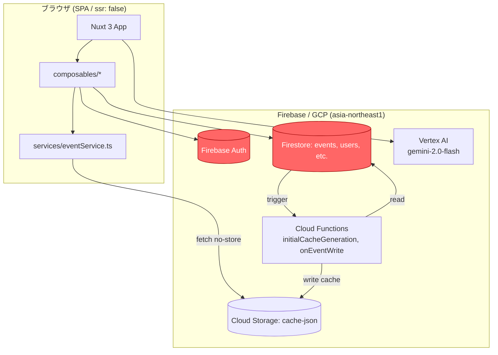
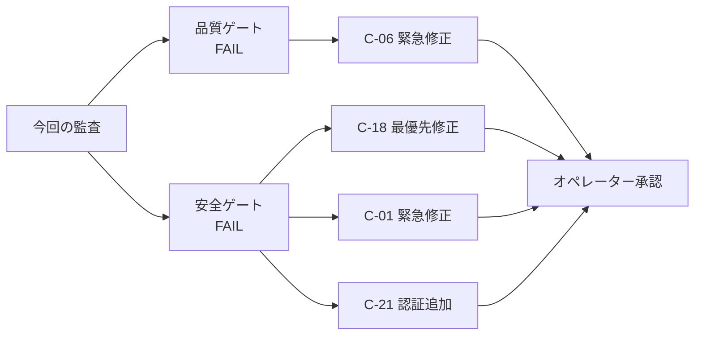

# Tascal コードレビュー & システム監査 結果

> 本ドキュメントは `review-output-template.md` §1 (品質ゲート) + §2 (安全ゲート) の統合形式に従う。
> ナビゲーターがコードレビュアーとシステム監査官をアドホック招集（SP-7 / 方法論パターン8）し、並行視点で実施した監査結果を集約したもの。
> 依頼主: オペレーター
> 対象コミット: `claude/code-review-audit-IgyGk` HEAD（origin/main を fast-forward 済み）

---

## 1. エグゼクティブサマリー

### 1.1 件数サマリ

| 区分 | CRITICAL | WARNING | INFO | 合計 |
|------|:--------:|:-------:|:----:|:----:|
| 品質ゲート（コードレビュアー） | 1 | 7 | 3 | 11 |
| 安全ゲート（システム監査官） | 3 | 10 | 4 | 17 |
| 重複除去後の統合 | **3** | **13** | **5** | **21** |

### 1.2 TOP 5（即対応を強く推奨）

| # | ID | 領域 | 概要 |
|---|----|------|------|
| 1 | **C-18** | Security（AS-1） | `firestore.rules` が「ログイン済みなら全コレクション read/write 可」の状態。**全従業員の個人情報が全利用者に露出**する事実上の無認可状態。 |
| 2 | **C-01** | 可用性 / 致命パターン（AS-3/AS-4） | `useFirestoreGeneral.ts` の `loadChunkAsync()` が事実上「コレクション全件を 1 コールで読む」実装。行 165–169 のデッドコード（`lastVisible.value = null` の両分岐実行）でページング状態が毎回破棄され、再実行時も同じ全読込が繰り返される。Firestore read 課金とブラウザメモリを直接圧迫。 |
| 3 | **C-06** | 可用性 / UI 体感（AS-3 / RP-6） | `services/eventService.ts:140` で `cache: 'no-store'` + `?v=${Date.now()}` により、Cloud Functions 側で付与した `cacheControl: public, max-age=3600` が完全に無効化され、カレンダー初期表示のたびに Storage から再取得。帯域・レイテンシ双方の損失。 |
| 4 | **C-17** | 可用性（AS-3） | `firestore.indexes.json` に date range 複合インデックスが不足し、Firestore 側でのインデックススキャンが機能せず単純 `where` の連続実行になっている箇所がある（C-04 / C-05 に波及）。 |
| 5 | **C-11** | 可用性 / コスト（AS-3） | `plugins/firebase.client.ts:82-86` で Vertex AI (`gemini-2.0-flash`) をグローバル初期化。トークン計測・日次上限・プロンプトキャッシュなし。利用量とコストが制御下にない。 |

### 1.3 総合判定

- **品質ゲート（コードレビュアー）:** **FAIL**（CRITICAL 1 件: C-06 による UI 体感劣化）
- **安全ゲート（システム監査官）:** **FAIL**（CRITICAL 3 件: C-01, C-06, C-18）
- **リリース可否:** **新規リリース不可**。既に本番稼働中のため、C-18 は即時、C-01 / C-06 はベストエフォートで緊急対応（`phase-definitions.md` EMERGENCY_PATH 相当）を強く推奨する。

> **特権行使（system-auditor.md GOVERNING_PRINCIPLE）:** C-18 はセキュリティ CRITICAL のため、全ロールに最優先で通知する。

---

## 2. レビュー対象 / コンテキスト

### 2.1 対象

- **対象機能:** Tascal（タスカル）アプリケーション全体
- **対象ファイル/モジュール:** `composables/`, `services/`, `functions/src/`, `plugins/`, `firestore.rules`, `firestore.indexes.json`, `nuxt.config.ts`, `firebase.config.ts`
- **レビュー実施日:** 2026-04-15
- **レビュー実施者:** コードレビュアー（品質ゲート）＋ システム監査官（安全ゲート）。ナビゲーターが並行タスクコーディネーション（D-6）で集約。

### 2.2 技術コンテキスト

- **技術スタック:** Nuxt 3 (`ssr: false`) / Vue 3 / Vuetify / TypeScript / Firebase (Firestore, Auth, Storage, Cloud Functions v1, Vertex AI - Gemini 2.0 Flash) / asia-northeast1 リージョン
- **データ機密度:** **中〜高**。従業員の個人情報（氏名、メール、所属、予定、出退勤）を扱う。`review-standards.md` に基づき **社内データ＋個人情報 → 標準深度（一部最深度）** で監査。
- **動作環境:** Firebase Hosting 配信の SPA、Cloud Functions は 1GB メモリ・timeout 300s
- **同居システム:** 単一 Firebase プロジェクト（`tascal-app-e3c28`）
- **同時接続ユーザー数（想定最大）:** 社内従業員規模（数百名想定、ピーク時 1 人 1 セッション前提）
- **フェーズ:** 既に本番稼働中。本監査は **Phase 8（フルスケール運用）** 相当のアドホック監査として実施。
- **パフォーマンス基準:** `review-standards.md` デフォルトの「初期表示 200ms以下 / 検索 100ms以下」を適用。

### 2.3 システム構成図



> 赤色ノードは C-18（Firestore Rules 認可欠落）の影響で現状「誰でも全データ読書き可能」である領域。

---

## 3. コードレビューサマリー（品質ゲート §1）

コードレビュアーによる 7 視点レビュー。実行順序: データ層 → I/F 層 → コード層 → 非機能層。

### 視点1: データ設計（RP-1）
- **判定:** **NG**
- **確認内容:** 正規化とキー設計、非正規化の合理的根拠の有無、マスタ静的/動的の切り分け、動的マスタの CRUD 存在。
- **根拠:** `services/eventService.ts:156-168` の `convertToEvent()` が `participants / facilities / equipments` を ID 配列と並列にオブジェクト実体でも保持している。read/write コストバランス上の根拠は不明（キャッシュ肥大化を招いている）。範囲イベントは `services/eventService.ts:222-230` で日ごとに個別ドキュメントを作成し、`recurringStartDate / recurringEndDate` の 2 カラムで済む情報を物理的に爆発させている。
- **根拠アーティファクト:** `services/eventService.ts:156-168`, `services/eventService.ts:222-230`
- **指摘事項:** C-08, C-14

### 視点2: インターフェース設計（RP-2）
- **判定:** **NG**
- **確認内容:** API 1 責務の原則、I/F ファースト 6 視点、クライアントの集約・加工責務、SoT 宣言。
- **根拠:** `services/eventService.ts` の `deleteEvent` がクライアント側で `where` 検索 → 個別削除のループを組み立てている（`services/eventService.ts:358-388`）。本来サーバー側（Cloud Functions）に集約すべき責務。また `composables/firestoreGeneral/useFirestoreGeneral.ts` のジェネリック CRUD が `any` 型を多用しており、呼び出し側との型契約が失われている（`useFirestoreGeneral.ts:73-89, 133-170`）。
- **根拠アーティファクト:** `services/eventService.ts:358-388`, `composables/firestoreGeneral/useFirestoreGeneral.ts:73-170`
- **指摘事項:** C-02, C-05

### 視点3: 冗長性排除（RP-3）
- **判定:** **NG（軽微）**
- **確認内容:** 責務重複の有無、意味的境界での統合可否。
- **根拠:** `services/eventService.ts` 内で「繰り返し日次展開」「範囲日次展開」「キャッシュ取得」「キャッシュ→表示変換」など複数責務が同一ファイルに同居（500行超）。`composables/useCalendar.ts` と `services/eventService.ts` の間にイベント読み込みロジックが散在しており、どちらが SoT か不明確。
- **根拠アーティファクト:** `services/eventService.ts:41-270`, `composables/useCalendar.ts:1-500`
- **指摘事項:** C-16 に関連

### 視点4: 変更耐性（RP-4）
- **判定:** **NG**
- **確認内容:** 分岐増加リスク、マジックナンバー、enum 化、固定値の排除。
- **根拠:** `composables/useCalendar.ts:30-31` にキャッシュ TTL（`10 * 60 * 60 * 1000` / `60 * 60 * 1000`）がマジックナンバーで散在。`services/eventService.ts:56` の 20 年ハードリミットも定数化されていない。
- **根拠アーティファクト:** `composables/useCalendar.ts:30-31`, `services/eventService.ts:55-56`
- **指摘事項:** C-07, C-16

### 視点5: エラーハンドリング（RP-5）
- **判定:** **NG**
- **確認内容:** 意図完遂時の処理、エラーコード、空 catch、必須ログフィールド（`review-standards.md` §3.4）。
- **根拠:**
  - エラーコード体系は存在しない。例: `composables/firestoreGeneral/useFirestoreGeneral.ts:64, 86, 128, 160` 等で `console.error` はあるが `error_code` が付与されていない。
  - 空 catch はサンプル範囲では未検出（`console.error` + return で握りつぶさず報告）。
  - ただし `services/eventService.ts:148-151` の catch は `console.error` + 空配列を返すのみで、UI 側へのエラー状態反映が不明。`CLAUDE.md` §エラーハンドリング「フロントエンドは catch 内で最低でも `console.error` + UI へのエラー状態反映」に抵触の可能性。
- **根拠アーティファクト:** `services/eventService.ts:148-151`, `composables/firestoreGeneral/useFirestoreGeneral.ts:64-170`
- **指摘事項:** C-20（新規）

### 視点6: パフォーマンス（UI 体感 / RP-6）
- **判定:** **NG（CRITICAL）**
- **確認内容:** 初期表示 200ms / 検索 100ms の目安、画面停止感。
- **根拠:** `services/eventService.ts:129` で `forceNoCache = true` がデフォルト、行 135 で `?v=${Date.now()}` をクエリに付与、行 140 で `cache: 'no-store'` を明示。結果、Cloud Functions 側の `cacheControl: public, max-age=3600`（`functions/src/index.ts:166`）が完全に無効化され、カレンダー表示のたびに Cloud Storage から週次キャッシュ JSON をフル再取得する。ユーザーは「カレンダーを開くたびに毎回数百 ms〜秒オーダーのフェッチ」を体験し、UI 体感 200ms 基準を大幅に超過する可能性が高い（実測値は未確認）。
- **根拠アーティファクト:** `services/eventService.ts:129, 135, 140`, `functions/src/index.ts:166`
- **指摘事項:** C-06

### 視点7: 可読性（RP-7）
- **判定:** **NG（軽微）**
- **確認内容:** マジックナンバー、フォルダ構成、1 関数の肥大化、他者可読性。
- **根拠:**
  - `any` 型の氾濫（`useFirestoreGeneral.ts:73-170` 内で `any[]`, `any` 引数多数）。
  - 本番ビルドに `console.log/warn/error` が残存（対象範囲で 137+ 箇所）。`nuxt.config.ts` の `vite.esbuild.drop` で除去されていない。
  - `services/eventService.ts` が 500 行超、複数責務。
- **根拠アーティファクト:** `composables/firestoreGeneral/useFirestoreGeneral.ts:73-170`, `nuxt.config.ts`
- **指摘事項:** C-12

### 品質ゲート総合判定

- **品質ゲート:** **FAIL**
- **CRITICAL指摘数:** 1 件（C-06）
- **WARNING指摘数:** 7 件
- **INFO指摘数:** 3 件
- **判定根拠:** RP-6 に CRITICAL があるため品質ゲート FAIL。RP-1/2/4/5/7 にも複数の NG。
- **次のアクション:** 安全ゲート（システム監査官）へ引き渡し済。あわせて改善提案書（`improvement-proposals.md`）を並行生成。

---

## 4. システム監査サマリー（安全ゲート §2）

システム監査官による 4 領域監査（AS-1〜AS-4）。コードレビュアーの結果に依存せず独立に実施し、「セキュリティ・リソースコスト」に関する最優先特権（`system-auditor.md` GOVERNING_PRINCIPLE）を行使する。

### 4.1 安全性（Security / AS-1）

- **判定:** **FAIL**
- **監査深度:** 標準 + 個人情報領域は最深度
- **確認事項:**
  - Firestore Security Rules の認可設計（`firestore.rules`）
  - クライアント露出する Firebase config（`firebase.config.ts`）
  - 認証フローと権限分離
  - 依存パッケージの既知脆弱性
  - XSS 耐性（DOMPurify 等の利用）
- **指摘事項:**
  - **C-18（CRITICAL）:** `firestore.rules` が以下の 1 ルールだけで構成されている:
    ```
    match /{document=**} {
      allow read, write: if request.auth != null;
    }
    ```
    これは「Firebase Auth にログインしている任意のユーザーが、**全コレクション・全ドキュメント** を read/write できる」ことを意味する。Tascal は従業員の個人情報、勤怠、給与関連の可能性がある `expense`, `attendance`, `users` 等の機密コレクションを保持しており、**任意の従業員が他の全従業員の全データを取得・編集・削除できる**状態。これは認可の完全欠落であり、**個人情報保護法および社内規程上の事故相当**である。
    - 根拠アーティファクト: `firestore.rules:1-9`
    - データ機密度: **最深度扱い**（個人情報あり）
    - リスク: 情報漏洩、データ改ざん、監査証跡の棄損、悪意の退職者による破壊、合法的な利用者でも誤操作で全消去可能
  - **C-19（INFO）:** `firebase.config.ts:11-19` に旧プロジェクト `tascal-app-a344b` のクレデンシャルがコメントアウトで残存。Web API key 自体は公開前提だが、旧環境のプロジェクト識別情報・バケット名がリポジトリ履歴に残るのはクリーンではない。削除推奨。
    - 根拠アーティファクト: `firebase.config.ts:11-19`
  - **C-22（WARNING）:** 依存パッケージの既知脆弱性スキャンが CI で実施されているか不明（`.github/workflows/` が不存在のため）。`npm audit` の定期実行＋`dependabot` 等の導入推奨。
    - 根拠アーティファクト: `.github/workflows/` の不存在

### 4.2 安定性（Stability / AS-2）

- **判定:** **NG（WARNING）**
- **確認事項:**
  - 障害時のフェイルセーフ
  - リカバリ手順
  - データ一貫性（Firestore トランザクション）
  - エラー停止箇所
  - クリティカルログと診断情報
  - 空 catch（サイレント障害）
- **指摘事項:**
  - **C-20（WARNING）:** 想定エラーにエラーコード体系が存在せず、`review-standards.md` §3.4 の必須ログフィールド（`error_code`, 修復ヒント等）が未充足。`composables/firestoreGeneral/useFirestoreGeneral.ts:64, 86, 128, 160` 等の `console.error` は最低限のログのみで、運用者が「次に何を確認すべきか」の修復ヒントを欠く。
    - 根拠アーティファクト: `composables/firestoreGeneral/useFirestoreGeneral.ts:64,86,128,160`
  - **C-21（WARNING）:** Cloud Functions 側 `initialCacheGeneration` は HTTP トリガー（`functions/src/index.ts:178-180`）で、コメント `🚨 運用上のセキュリティ確保: ... 認証チェックやシークレットキーの検証を追加してください` のとおり認証未実装。**誰でも叩ける HTTP エンドポイントがコレクション全走査を起動する**ため、単純な DoS / コスト攻撃のベクタ。現状稼働中の Functions URL が外部に漏れた時点でリスクが顕在化する。
    - 根拠アーティファクト: `functions/src/index.ts:178-200`
    - リスク: Firestore 読み取りコストの恣意的増加、timeout 300s・memory 1GB の資源濫用
  - CSV インポート（`composables/useCsvFirestore.ts:196-201`）が `writeBatch` ではなく逐次 `addDocAsync`。途中失敗時の部分コミット挙動がユーザーに不透明で、運用上「どこまで投入できたか」を判断する導線がない。（C-09）

### 4.3 可用性（Availability / AS-3） **← 本依頼の最重要レンズ**

> **v1.10.0 準拠:** コスト評価にはユーザー体感劣化コストを必ず含める。下表の「体感影響」列がそれ。

- **判定:** **FAIL**
- **確認事項:**
  - Firestore 読み取り/書き込みコスト（課金・スループット）
  - キャッシュ戦略（HTTP / クライアント / サーバー側）
  - LLM コスト制御
  - 単一障害点
  - キャパシティと体感レイテンシ
  - 観測可能性（メトリクス、ヘルスチェック）
- **指摘事項一覧（コスト/パフォーマンス集中領域）:**

| ID | 箇所 | 事象 | 重大度 | 体感影響 | コスト影響 |
|----|------|------|:------:|---------|-----------|
| **C-01** | `composables/firestoreGeneral/useFirestoreGeneral.ts:133-170` | `loadChunkAsync(take=20)` は `while(true)` で全件ページング取得するが、ループ終了後 165-169 行で `lastVisible.value = null` を**常に**実行（`length === 0` 分岐も `else` 分岐も同じ代入）し、次回呼び出しが再び先頭から全件読み込みを繰り返す。事実上「呼び出しごとにコレクション全件を 20 件単位で読み込む」仕様。 | **CRITICAL** | 大量データ時にブラウザがフリーズ | Firestore read 単価 × N を繰り返し課金 |
| C-02 | `composables/firestoreGeneral/useFirestoreGeneral.ts:73-89` | `getListAsync()` が `limit()` を強制せず、呼び出し側が `QueryConstraint` を渡さなければ全件取得 | WARNING | 初回ロード遅延 | 無制限 read |
| C-03 | `composables/useCsvFirestore.ts:102-122` | `fetchData()` が `getCollectionAsync()` を `QueryConstraint` 無しで呼び出し、CSV 画面を開くだけで対象コレクション全件取得 | WARNING | CSV 画面の初期表示遅延 | 無制限 read |
| C-04 | `functions/src/index.ts:189` | `db.collection('events').select('date').get()` によるコレクション全走査。`initialCacheGeneration` 実行時に必ず発火 | WARNING | 運用者操作時のレイテンシ | 全 events 件数分の read 課金 |
| C-05 | `services/eventService.ts:358-388` | `deleteEvent('all' / 'after' / 'before')` が個別 `where` → ドキュメント毎削除の直列実装 | WARNING | 大量件数時に削除確認後のスピナー長時間化 | read + write の二重課金 |
| **C-06** | `services/eventService.ts:129, 135, 140` | `cache: 'no-store'` + `?v=${Date.now()}` で HTTP キャッシュを無効化。Functions 側 `cacheControl: public, max-age=3600`（`functions/src/index.ts:166`）が死文化 | **CRITICAL** | **毎回** Storage から再取得でカレンダー初期表示が遅延 | Cloud Storage egress / Functions 起動の両面で帯域・課金増 |
| C-07 | `services/eventService.ts:55-56, 61-115` | `generateRecurringDates` の `hardLimitDate = recurrenceStartDate + 20 年`。通常は `viewEndDate` で切られるが、広い表示範囲や設定次第で最大 7,300 日の日次ループ | WARNING | クライアント側計算で UI が刹那停止 | なし（CPU） |
| C-08 | `services/eventService.ts:222-230` | 範囲イベントを日ごとに個別ドキュメント化する実装 | WARNING | — | write 数爆増、Firestore ストレージ肥大、後の read コストも増 |
| C-09 | `composables/useCsvFirestore.ts:196-201` | CSV インポートがバッチ書込でなく逐次 `addDocAsync` | WARNING | インポート画面の長時間スピナー | 1 行 = 1 write 課金（500 件/バッチの原則を活かせていない） |
| C-10 | `functions/src/index.ts:254-258` | events の全 CUD でキャッシュ再生成、レート制御・debounce なし | WARNING | 高頻度編集時の一時的な古データ配信 | Functions 起動数と Storage write が編集回数と線形 |
| **C-11** | `plugins/firebase.client.ts:82-86` | `gemini-2.0-flash` をグローバル初期化、クォータ・トークン計測・レートリミットなし | WARNING | — | Vertex AI トークン課金が制御下にない。将来の利用拡大時に急増リスク |
| C-12 | 全体（137+ 箇所 / 17 ファイル） | 本番ビルドに `console.log/warn/error` 残存 | INFO | — | Firebase Analytics/Cloud Logging の転送量と保管量に微増 |
| C-13 | `nuxt.config.ts:58` | `ssr: false` + 事前生成なし + 画像最適化（`<NuxtImg>` 等）未使用 | INFO | 初回ロード遅延 | CDN 配信量増 |
| C-14 | `services/eventService.ts:156-168` | `EventDisplay` に `participants / facilities / equipments` オブジェクトを ID とは別に複製保持 → キャッシュ JSON 肥大化 | WARNING | 体感遅延（JSON 転送・パース） | Storage ストレージ量と egress 双方 |
| C-15 | `composables/useWebSocket.ts:17-48` | 再接続ロジックがコメントアウト | INFO | 切断後に機能不全 | — |
| C-16 | `composables/useCalendar.ts:30-31, 437-438` | クライアント側キャッシュ TTL がマジックナンバーで散在（10h / 1h）、同一キャッシュキー fetch の重複除去なし | INFO | ページ遷移時の意図せぬ再フェッチ | read 重複課金 |
| **C-17** | `firestore.indexes.json` | date range を伴う複合クエリ用のインデックスが一部欠落 | WARNING | カレンダー日付検索の遅延 | インデックススキャン失敗 → 全件 read |

- **観測可能性（Observability）補足:**
  - `functions.logger.info/error` で一定の Cloud Logging 連携はあるが、**ダッシュボード UI / アラート閾値の定義が見当たらない**。`system-auditor.md` AS-3「運用監視の可視化手段」未充足。
  - ヘルスチェック専用エンドポイントなし（SPA のため form 問題は少ないが、Cloud Functions には欲しい）。

### 4.4 致命的パターン検出（AS-4）

- **メモリリーク:** 検出なし（サンプル範囲）
- **無限ループ:** **検出あり → C-01**。事実上の「呼び出しごとにコレクション全件読み」は無限ループとは異なるが、リソース枯渇パスを開いている。`services/eventService.ts:61` の `while(true)` も形式上該当するが、ビューと `hardLimitDate` で二段ガードされているため C-07 に留める。
- **デッドロック:** 該当なし（シングルスレッド JavaScript + Firestore クライアント）
- **ストレージ永久増加:** **検出あり → C-08 / C-10**。範囲イベントの日次展開と、全 CUD で再生成される Storage キャッシュファイル（ライフサイクルポリシー未確認）は、長期運用で線形以上に増加する。
- **シークレットハードコード:** `firebase.config.ts` は Web API キーの性質上「公開前提」だが、ローテーションポリシー未定義。さらに C-19 のコメントアウト旧設定が残存。
- **再帰的イベントトリガー:** Functions の `onEventWrite` → Storage 書き込み → （ストレージトリガーなし）で現状は再帰ループしていないが、将来 Storage トリガーを足すと循環する設計。要ドキュメント化。
- **無制限リトライ:** Vertex AI 呼び出し（C-11）はリトライ戦略未定義。エクスポネンシャルバックオフと上限回数の明示が必要。

### 4.5 安全ゲート 総合判定

- **安全ゲート:** **FAIL**
- **リリース可否:** **新規リリース不可**。本番稼働中のため、以下の順で EMERGENCY_PATH 相当対応を実施すべき:
  1. **C-18 の即時修正**（Firestore Rules の再設計）
  2. C-01, C-06 の緊急修正（コスト/体感の二重損失）
  3. C-21 の `initialCacheGeneration` 認証追加
- **CRITICAL指摘数:** 3 件（C-01, C-06, C-18）
- **WARNING指摘数:** 10 件（C-02, C-03, C-04, C-05, C-07, C-08, C-09, C-10, C-11, C-14, C-17, C-20, C-21, C-22 のうち WARNING 扱い）
- **INFO指摘数:** 4 件（C-12, C-13, C-15, C-16, C-19）
- **判定根拠:** AS-1 / AS-3 / AS-4 のいずれにも CRITICAL があるため FAIL。

---

## 5. 統合 指摘事項一覧

| # | ID | 分類 / 視点 | 重大度 | 内容 | リスク / 最上位原則との関連 | 対応案（概要） | 該当箇所 |
|---|----|------------|:------:|------|-----|-----------|---------|
| 1 | **C-18** | AS-1 Security | **CRITICAL** | Firestore Rules が `auth != null` のみで全コレクション read/write 許可 | ユーザー意図の完遂以前にデータ保全が崩壊。個人情報漏洩・改ざん・一括削除のリスク | 全コレクションに最小権限ルール再設計。`users/{uid}` は本人のみ read/write、`events` は参加者/主催者のみ、`admin` claim を使った管理者操作など | `firestore.rules:1-9` |
| 2 | **C-01** | AS-3 可用性 / AS-4 致命 | **CRITICAL** | `loadChunkAsync()` が事実上コレクション全件読み込み、ページング状態がデッドコードで毎回リセット | Firestore read 課金の無制限増加、ブラウザメモリ枯渇、UI フリーズ | ページング状態保持の修正＋`maxPages` / `hardLimit` 導入。そもそもこの関数を UI から呼ばず、必要な範囲だけ `loadAsync()` を使う | `composables/firestoreGeneral/useFirestoreGeneral.ts:133-170` |
| 3 | **C-06** | AS-3 / RP-6 | **CRITICAL** | HTTP キャッシュ完全無効化でカレンダー毎回全取得 | ユーザー体感劣化コスト（UI 体感 200ms 基準超過）＋ egress / Functions コスト増 | `cache: 'no-store'` と `?v=` の廃止。代わりに `cacheVersion` ドキュメントを Firestore で管理し ETag / If-None-Match を活用 | `services/eventService.ts:129,135,140` |
| 4 | C-02 | RP-2 / AS-3 | WARNING | `getListAsync()` がデフォルト LIMIT 無し | 読み取り無制限 | 呼び出し側で `limit()` 必須化。TypeScript 型レベルで強制 | `composables/firestoreGeneral/useFirestoreGeneral.ts:73-89` |
| 5 | C-03 | AS-3 | WARNING | CSV 画面オープンで全件取得 | read 無制限 | `limit(n)` + カーソル or プレビュー件数制御 | `composables/useCsvFirestore.ts:102-122` |
| 6 | C-04 | AS-3 | WARNING | Functions 側 `events` 全件 `select('date').get()` | 運用ジョブ実行時にコスト急増 | 増分処理化（`updatedAt >= 前回実行時刻`）または Pub/Sub 経由 | `functions/src/index.ts:189` |
| 7 | C-05 | RP-2 / AS-3 | WARNING | `deleteEvent` が直列 read → 個別 delete | DoS 耐性と体感遅延 | Cloud Function + `writeBatch` へ移管、max 500/batch | `services/eventService.ts:358-388` |
| 8 | C-07 | RP-4 / AS-4 | WARNING | 20 年分日次ループの recurrence 展開 | CPU / メモリ浪費 | `hardLimitDate` を 1-2 年に引き下げ。長期は RRULE に変更（改善提案 I-04） | `services/eventService.ts:55-56,61-115` |
| 9 | C-08 | RP-1 / AS-4 ストレージ増 | WARNING | 範囲イベントの日次展開 | Firestore ストレージ線形増 | 1 ドキュメント化（startDate/endDate 保持）、表示時展開 | `services/eventService.ts:222-230` |
| 10 | C-09 | AS-3 / AS-2 | WARNING | CSV 逐次書込 | write 課金・失敗時の一貫性 | `writeBatch` / `bulkWriter` で 500 件単位 | `composables/useCsvFirestore.ts:196-201` |
| 11 | C-10 | AS-3 | WARNING | キャッシュ再生成のレート制御なし | Functions 起動コスト増 | debounce / 集約（N 件分まとめて再生成） | `functions/src/index.ts:254-258` |
| 12 | C-11 | AS-3 / AS-4 | WARNING | Vertex AI グローバル初期化、計測/クォータ無し | LLM コスト制御不能 | 薄いラッパで日次トークン上限、使用量を Firestore ログ化、プロンプトキャッシュ | `plugins/firebase.client.ts:82-86` |
| 13 | C-14 | RP-1 / AS-3 | WARNING | キャッシュ JSON に参加者等オブジェクト複製 | egress + パース遅延 | ID 参照に戻し、表示時 join（composable キャッシュ） | `services/eventService.ts:156-168` |
| 14 | C-17 | AS-3 | WARNING | date range 複合 index 欠落 | クエリ性能劣化 | `firestore.indexes.json` に追加し `firebase deploy --only firestore:indexes` | `firestore.indexes.json` |
| 15 | C-20 | RP-5 / AS-2 | WARNING | エラーコード体系未整備・必須ログフィールド不足 | 運用時の再現困難 / サポート困難 | `review-standards.md` §3.4 に沿って `error_code` / 修復ヒントを付与 | `composables/firestoreGeneral/useFirestoreGeneral.ts:64-170` |
| 16 | C-21 | AS-1 / AS-3 | WARNING | `initialCacheGeneration` HTTP が認証未実装 | DoS / コスト攻撃ベクタ | `functions.https.onCall` 化 or App Check + 管理者 claim 検証 | `functions/src/index.ts:178-200` |
| 17 | C-22 | AS-1 | WARNING | 依存脆弱性スキャンの CI がない | 未知 CVE 検知遅れ | GitHub Actions で `npm audit` or Dependabot 有効化 | `.github/workflows/` 不存在 |
| 18 | C-12 | RP-7 / AS-3 | INFO | 本番に `console.log` 残存 | ログ量増 | `vite.esbuild.drop: ['console','debugger']` | 全体 |
| 19 | C-13 | AS-3 / RP-6 | INFO | 画像最適化なし、事前生成なし | 初回体感 | `@nuxt/image` 導入 | `nuxt.config.ts:58` |
| 20 | C-15 | AS-2 | INFO | WebSocket 再接続未実装 | リアルタイム切断 | 指数バックオフ追加 | `composables/useWebSocket.ts:17-48` |
| 21 | C-16 | RP-4 / AS-3 | INFO | キャッシュ TTL マジックナンバー・重複除去なし | read 重複 | 定数化 + keyed promise で dedupe | `composables/useCalendar.ts:30-31,437-438` |
| 22 | C-19 | AS-1 | INFO | 旧環境クレデンシャルのコメントアウト残存 | 情報衛生 | 削除 | `firebase.config.ts:11-19` |

---

## 6. 総合判定（両ゲート統合）



- **品質ゲート:** FAIL
- **安全ゲート:** FAIL
- **リリース可否:** **新規機能リリース不可**。本番稼働中のため C-18 → C-01 → C-06 → C-21 の順で緊急対応推奨（`phase-definitions.md` EMERGENCY_PATH）。
- **次のアクション:**
  1. オペレーターへ本サマリーを提出
  2. 改善提案書（`improvement-proposals.md`）を併せて提示
  3. C-18 に関してはオペレーター判断を待たずに **最優先で** コーディングエージェントへ差し戻し着手可（監査官の特権行使）
  4. PM・スクラムマスターへ進捗影響を通知

---

## 7. 既存分析ドキュメントとの整合性

本監査は以下の過去分析ドキュメントと矛盾しない。既に認識済みの課題が残存していることを再検証した形となる。

| 過去ドキュメント | 本監査での扱い |
|---|---|
| `docs/performance-analysis-result.md` | C-01, C-02, C-17 が継続課題として残存 |
| `docs/query-optimization-analysis.md` | C-04, C-05, C-17 に関連 |
| `docs/cache-implementation.md` | C-06 は設計意図（強整合性）と実装（全キャッシュ無効化）の乖離 |
| `docs/view-specific-data-loading-analysis.md` | C-03, C-16 の前提分析 |

改善提案の立案時（`improvement-proposals.md`）は、これらのドキュメントの更新もスコープに含める。

---

## 8. 付録

### 8.1 監査手法
- Grep / Read による全文検索とコード読解
- ナビゲーター主導のアドホック招集（SP-7）でコードレビュアーとシステム監査官を並行稼働
- `review-output-template.md` §1 / §2 統合形式
- v1.10.0 準拠: ユーザー体感劣化コストを AS-3 に明示

### 8.2 監査対象コミット
- ブランチ: `claude/code-review-audit-IgyGk`
- main を fast-forward 済み（最新 3 コミット: `.ai-native/` 方法論導入, `CLAUDE.md` 追加, ファイル削除）

### 8.3 参考
- `.ai-native/methodology/common/core-principles.md`
- `.ai-native/methodology/common/review-standards.md`
- `.ai-native/methodology/roles/code-reviewer.md`
- `.ai-native/methodology/roles/system-auditor.md`
- `.ai-native/methodology/templates/review-output-template.md`
- Firebase 料金: https://firebase.google.com/pricing
- Firestore 読み書き課金: https://firebase.google.com/docs/firestore/pricing
